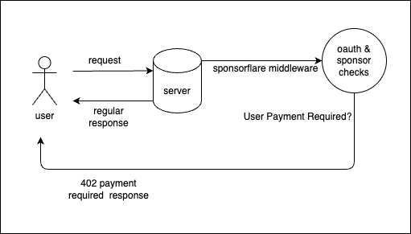
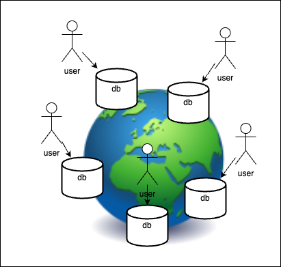
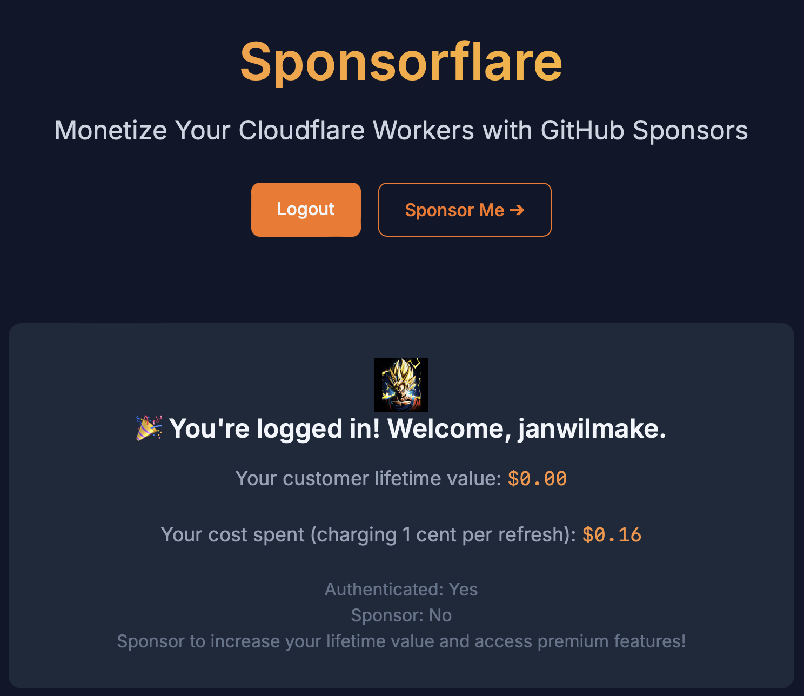

# Sponsorflare - Cloudflare Middleware for easy Monetisation of a worker using GitHub Sponsors

Inspired by [sponsorware](https://github.com/sponsorware/docs) and [this blog](https://calebporzio.com/sponsorware), sponsorflare aims allowing for [cloudflare workers](https://workers.cloudflare.com) monetisation in a few lines of code.



Examples:

- this repo itself exposes https://sponsorflare.com at [main.ts](main.ts)
- https://github.com/janwilmake/zipobject - example of ratelimit + github oauth + bandwidth-based monetisation

## Usage

Installation:

1. run `cp .dev.vars.example .dev.vars`
2. create a github oauth client at https://github.com/settings/applications/new with the right redirect URI, and get the client ID and secret
3. accept sponsors at your github account. you first need to be approved
4. once accepted, go to: your sponsor dashboard -> webhook -> add webhook
   1. URL: one of your workers at `/github-webhook`
   2. add a secret that you save to `.dev.vars`
   3. content type: JSON
5. run `npm i sponsorflare` (or copy over the `sponsorflare.ts` file)

`wrangler.toml`:

```toml
[vars]
GITHUB_REDIRECT_URI = "https://yourworkerdomain.com/callback"
LOGIN_REDIRECT_URI = "/"
ADMIN_OWNER_LOGIN = "your_admin_github_username"
COOKIE_DOMAIN_SHARING = "false" # set this to true, if you want to share the cookie for the entire hostname/domain including all subdomains

[[durable_objects.bindings]]
name = "SPONSOR_DO"
class_name = "SponsorDO"

[[durable_objects.bindings]]
name = "RATELIMIT_DO"
class_name = "RatelimitDO"

[[migrations]]
tag = "v1"
new_sqlite_classes = ["SponsorDO", "RatelimitDO"]

```

`main.ts`:

```ts
import { middleware, getSponsor, Env } from "sponsorflare";
export { SponsorDO, RatelimitDO } from "./sponsorflare";

export default {
  fetch: async (request: Request, env: Env) => {
    // This middleware adds /login, /callback, and /github-webhook endpoints
    const sponsorflare = middleware(request, env);
    if (sponsorflare) return sponsorflare;

    // This is how you charge someone and/or get the sponsor info
    const { charged, ...sponsor } = await getSponsor(request, env, {
      charge: 1,
    });

    if (!charged) {
      return new Response("Payment required.", {
        status: 402,
        headers: { Location: "https://github.com/sponsors/janwilmake" },
      });
    }

    // Do your paid stuff here after charging the user
  },
};
```

## How does it work?

This implementation uses a [Cloudflare Durable Object](https://developers.cloudflare.com/durable-objects/) for each user, to store their charges in their own database. Because of this, the charging happens at the location near to where the worker is executing the request, and it's incredibly fast. We can call it 'Physical Database-per-tenant' because each database is physically separated from others and very close to users.



- When the user doesn't have any 'authorization' cookies, the request takes anywhere between 25-120ms (normal for a worker)
- When the user is authorized and we need to charge them, the request takes anywhere between 50-120ms because it needs to do an extra request between the worker and the DO (not much slower!)
- If we would've used a regular D1 database (or another consistent one, which requires it to be global) the request would take anywhere between 230ms and 1000ms, depending on where it is coming from (not measured much). Much slower!

## An idea for a new storage service

This design pattern of a DO per user can be expanded to store more state for a user. If you don't have too many logic that connects many different users and their state in your worker/app, it allows for stateful apps without having a central database!

Everyone their own DB ❤️ Attached to a oauth service like Google, GitHub, or X to get a userID.

As a result, now your users can access their data, safely stored on the edge, within 10-20ms + ±40ms to access the worker.

How cool would that be?! [(Pls respond)](https://x.com/janwilmake/status/1884550721795653931)

## CHANGELOG

### 2025-01-25

Built oauth github-login in a secure way! finally! one file way of doing this in a worker that is easily copy-paste-able. Great!

### Creating the POC (2025-01-26)

1. Built https://github.com/janwilmake/xlogin
2. Decided Sponsorware is the GOAT. https://github.com/sponsorware/docs
3. ✅ Create a standalone repo called `cloudflare-sponsorware` that you can just use it with your app to allow for github login, github watching sponsorship events, and keeping the KV. people can use their own github acc and cloudflare acc for this. Open source.
4. ✅ Buy sponsorflare.com and set up the repo and [tweet](https://x.com/janwilmake/status/1883493435635585198)
5. ✅ Make sponsorflare github oauth work (took just 5 minutes!) and create indended demo-layout with Deepseek (took just 1 minute)
6. ✅ Take a deep breath. Look into the apis and find which APIs and webhooks are needed (and validate this is even possible as the way I want it).
7. ✅ Test out retrieving required information from a sponsor with matching userId.
8. ✅ Created getSponsors function.
9. ✅ Create consistent storage: D1 with `type Sponsors={source,ownerId,ownerLogin,clv,spent}` for the POC.
10. ✅ Upsert user upon login
11. ✅ Ensure webhooks get delivered (https://docs.github.com/en/webhooks/using-webhooks/handling-webhook-deliveries)
12. ✅ Upsert user upon webhook: sync using `getSponsors` storing total livetime value with money spent ensuring it makes sense.
13. ✅ Create `access_tokens` table that maps `access_token` to `sponsorid`
14. ✅ Now I can make function `getSponsor(request,env,config?:{charge?:number})` that charges and/or gets clv/spent of the current request.

Yeah! The Proof of Concept is out there. You can choose to simply use it by installing the package, or use it as a template and build it out further if you so desire. I'm going to be using this for most of my products.



### Moving from a single D1 SQLite DB to a durable object per user! (2025-01-27)

I learned that we can improve latency by using user-based DOs rather than a globally central database. This has a side-effect that we can't recall all active users, but that's also not something we need!

So I asked claude to update this code so:

It uses a Durable object instead of d1 database with a storage containing a storage for each access token (the key is the access_token, the value is 'true') and for the sponsor (key is 'sponsor')

1. upon /callback

- it puts the owner_id in a cookie
- it spawns a DO with name equal to `owner_id`
- it sets the access_token and the sponsor in the DO (ensure to use the access_token as key, not value)
- it redirects like it does now (but with extra owner_id cookie)

2. upon `getSponsor`

- it looks for DO with name equals the `owner_id` (from cookie)
- it confirms the access_token provided in the cookie is present in the DO, if not, abort
- it charges if that was requested by updating the sponsor in the DO
- it returns the same information like now in the DO response, then in the response of the function.

After this, I added one more measure for security, namely an idempotency key to a charge, to be sure the charge doesn't occur twice. It also tracks all charges.

There is no way possible to get an overview of all users with this implementation, and we also don't have a way to back up the data! Nevertheless, this is a very powerful way to charge people for using workers, and DO's should be sufficiently reliable to handle this usecase, I think.

Because we're not using a global database but a separate database per user, the response latency is incredibly low! This is because a DO always spawns as nearby the worker as possible, and stays there.

### 2025-01-28

✅ added easy way to login in development (skipping oauth) - `SKIP_LOGIN=true`

✅ added redirect_uri param to redirect elsewhere after login

✅ confirmed redirect_uri works

### 2025-01-29

✅ `COOKIE_DOMAIN_SHARING=true` should be a configurable param.

✅ Added `getUsage` function that tracks usage.

✅ Ensure the URL is stored for every transaction.

✅ Learn more about the behavior of cookies and the specifications that are currently mostly implemented in 99% of used browsers. Write a thread on sponsorflare again and the concepts of sharing login across subdomains and the 'GitHub Automatic Login'.

✅ Become my own sponsor using a different Github Account, for $50/m, to test it works as intended, and test the flow. Especially: how fast does the credit get there?

✅ Fixed a bug where the ID couldn't be parsed and we missed a header for github

✅ Add ability to logout via `/logout` which removes headers, removes access from client, and takes `?redirect_uri`.

✅ Create `wilmake.cftemplate` template which basically just has all basic files for a new repo including a package of sponsorflare, so I can start with `gh repo create --public abcabc -p wilmake.cftemplate`

🔥 For the first time, I feel like I have a very powerful way of measuring work done with workers. Let's start using sponsorflare as a package and create a template.

### 2025-02-04

✅ Added ability to set balance of a user via the api using the admin token

✅ Created a `proxy` and an example to use it, in which we can keep a todo database per user. See: [user-todo-example.ts](user-todo-example.ts)

### 2025-02-14 QOL updates

- ✅ due to the fact that remote do doesnt contain the same state as locally, we now can't authenticate in sponsorflare remotely from localhost. this can be resolved by, in sponsorflare, checking and adding an unknown auth token, if `owner_id` was provided
- ✅ Ensure to store email in the DB as well as bio, twitter username, blog.
- ✅ Add ability to track created at, and last verified date
- ✅ To list all items in the namespace, use https://developers.cloudflare.com/api/resources/durable_objects/subresources/namespaces/subresources/objects/methods/list/ and retrieve "sponsor" from storage.
- ✅ Store more things like activity
- ✅ Created openapi to understand the endpoints in the middleware
- ✅ Sponsorflare fix oauth. Now errors.

### Revamp 2025-02-14

- ❌ Additional mapping from a global KV-stored sponsorflare-access-token to a user_id + access_token + scope. This way it remains fast as KV is replicated globally, while it also makes it easier to authenticate, since we don't need to set 3 different cookies/headers.
- ✅ Allow for single access-token Authorization Bearer token (encoded other 3) and expose the parsing/creation of this along with an improved `getAuthorization` function.
- ✅ Create a programmatic way to login by passing just a github access_token and returning the sponsorflare access_token after user_id+scope lookup. Can be `/login?token=XXX => string`
- ✅ Update sponsorflare version everywhere

### DO Observability (2025-03-11)

- ✅ Figure out how to make Sponsorflare an SQLite-enabled DO without loosing data https://developers.cloudflare.com/durable-objects/api/sql-storage/ --> **cannot be done. need export then import**
- ✅ `/usage` is now slow. Store transactions in SQL rather than KV (more efficient to query)
- ✅ export sponsorflare DO list by updating `/stats` and making it available in sponsorflare.
- ✅ Make a new DO that uses SQLite
- ✅ Convert stuff to use SQLite
- ✅ Deploy/publish this new version with README on how to migrate.

### bugfixes (2025-03-14)

- ✅ Fix bug with id sent as number, not as string, fixing the payments

### Finish Observability (2025-03-14)

- ✅ Finished login setup with new sponsorflare2 script
- ✅ export old sponsorflare one more time
- ✅ ensure sponsorship works. test with other account
- ✅ ensure I go to sponsorflare2 everywhere to avoid missing emails
- ✅ Also add it to Sponsorflare middleware such that I can visit the API over `/:id`
- ✅ Add https://gist.github.com/Brayden/dfbf51e889323484b10c7f4a7e343eb1 to Sponsorflare DO. For this, sponsorflare first needs to become a SQLite-enabled DO (✅)
- ✅ Deploy for Sponsorflare itself
- ✅ Try adding it as SQL Server in https://app.outerbase.com (Starbase)

🎉 Goal: migrate sponsorflare to sqlite and see all data in it. Also have a simple DO middleware + sqlite middleware that can be added to any DO.

### Create ratelimiter

For uithub I need to ensure unauthenticated people are ratelimited, and authenticated people that didn't pay are still able to use the app, based on how much they spent. The ratelimiter allows for this type of new behavior.

- ✅ Create a ratelimiter based on the IP that resets after X amount of requests.
- ✅ Update README and deploy as v1.2

### Improvement

- Insert the 100 users I had back into the DOs again
- Also track the "access_token" last use for each access_token.
- Ensure source of a user is the full domain, always. Seems not to be the case right now

### Solve logging

- `this.log` function that logs into a SQL table so I can track this via the dashboard. I can debug any DO now.
- Solve `forgithub.activity` in the same way by connecting SQL_dashboard and using `this.log` instead of console.log only.

🎉 Goal: have logging in forgithub activity so I know what's happening. try solve issue for merge!!

### Central Shadow DB

- Currently, fetching all users requires 1 subrequest per user, which can be problematic. We need a master DO that keeps track of user info. Let's try a master DO that simply we write to each time we execute a query, but in waitUntil, such that it's a direct clone of all stuff together, but it doesn't slow stuff down.
- If that's too slow, another way is with alarms. Each time a DO is activated, it can set an alarm (if not already) to back up itself to the master DO, within an hour.
- The master DB is great to explore over outerbases UI.

### Sponsorflare using X and skyfire

- Same but with X login and the alarm
- Already had flarefare but now reuse this and make the skyfire integration nicer. use the stripe button, replacing github sponsors with skyfire+stripe. It's a better flow for users coming from X if I don't need the code per se.
- xymake built from new sponsorflare base... but with wrapped DO with alarm and augmented data.
- merge the sponsorflare and evaloncloud into 1 product. probably best to call it evaloncloud and put the demo at demo.evaloncloud.com

### Ideas (Backlog):

- Sponsorflare Dashboard should be prettier. Ideally, the bar width is adjusted to the screen size and amount of bars.
- Builtin Unauthenticated Ratelimiting per IP; useful, but this is completely separate so can as well be a completely separate thing.
